# VisionProbe-AI

> **Visual Product Intelligence Platform** - Analyze products, assess impact, and make informed decisions with AI.

**VisionProbe-AI** is an advanced multi-agent AI system designed to analyze product images and provide deep insights. From visual identification to health impact analysis and ethical purchase recommendations, VisionProbe acts as your intelligent product assistant.

---

## 🏗️ System Architecture

VisionProbe relies on a sophisticated **Orchestrator Pattern**, managing a pipeline of specialized AI agents.

### Agentic Workflow
The system processes an image through a sequential chain of 6 agents, powered by **OpenAI GPT-5.1**:

```mermaid
sequenceDiagram
    participant User
    participant Frontend
    participant API
    participant Orchestrator
    participant VisualAgent as 👁️ Visual ID
    participant ContextAgents as 🧠 Context Agents
    participant ImpactAgent as 🌍 Impact Analysis
    participant BuyAgent as 🛒 Buy Link

    User->>Frontend: Upload Image
    Frontend->>API: POST /analyze
    API->>Orchestrator: Process(Image)
    
    rect rgb(20, 20, 30)
        note right of Orchestrator: Agent Pipeline
        Orchestrator->>VisualAgent: Identify Product
        VisualAgent-->>Orchestrator: {Product, Confidence}
        
        alt Low Confidence (<0.5)
            Orchestrator-->>API: Abort (Low Confidence)
        else High Confidence
            Orchestrator->>ContextAgents: Enrich & Use Cases
            ContextAgents-->>Orchestrator: {Knowledge, Usage}
            
            Orchestrator->>ImpactAgent: Assess Risk (Health/Env)
            ImpactAgent-->>Orchestrator: {RiskLevel, Impact}
            
            alt Risk is High
                Orchestrator->>Orchestrator: Skip Buy Links
            else Risk is Low/Medium
                Orchestrator->>BuyAgent: Find Ethical Options
                BuyAgent-->>Orchestrator: {BuyLinks}
            end
        end
    end
    
    Orchestrator-->>API: Final JSON Report
    API-->>Frontend: Display Report
```



1.  **👁️ Visual Identification Agent**
    *   Analyzes the uploaded image.
    *   Identifies product name, category, and brand.
    *   **Fail-Safe**: Aborts if confidence score is below 0.5.

2.  **🧠 Knowledge Enrichment Agent**
    *   Enhances the identification with factual context.
    *   Provides key features and common variants.

3.  **👥 Use Case Agent**
    *   Determines intended user demographics.
    *   Outlines practical usage scenarios and misuse warnings.

4.  **🌍 Impact Analysis Agent**
    *   Assesses **Health Impact**: Risks vs. benefits.
    *   Assesses **Environmental Impact**: Sustainability footprint.
    *   Calculates a composite **Risk Level** (High/Medium/Low).

5.  **💡 Recommendation Agent**
    *   Suggests safer or better alternatives if risks are detected.
    *   Provides actionable advice for better product choices.

6.  **🛒 Buy Link Agent**
    *   Provides direct purchase links to buy the product.
    *   **Safety Check**: If Risk Level is **High**, purchase links are disabled.

---

## 🛠️ Tech Stack

### Backend
*   **Framework**: Django & Django Rest Framework (DRF)
*   **AI Engine**: OpenAI API (GPT-5.1)
*   **Database**: PostgreSQL (Production) / SQLite (Dev)
*   **Image Processing**: Pillow (PIL)
*   **Task Management**: Custom Orchestrator

### Frontend
*   **Framework**: React (Vite)
*   **Styling**: TailwindCSS
*   **Animations**: Framer Motion
*   **Routing**: React Router DOM

---

## 🗺️ User Flow


1.  **Landing Page** (`/`): Introduction to the platform's capabilities.
2.  **Authentication** (`/auth`): Secure access via Login or Sign Up.
3.  **Dashboard** (`/dashboard`):
    *   **Upload**: User uploads a product image.
    *   **Analysis**: Watch the live agent steps (Identification -> Impact -> etc.).
    *   **Report**: View the final structured intelligence report.
4.  **Profile & Settings**: Manage user preferences and history.

---

## 🚀 Getting Started

Follow this step-by-step guide to set up the project locally.

### Prerequisites
*   **Python** 3.10+
*   **Node.js** 18+
*   **Git**

### Installation

#### 1. Clone the Repository
```bash
git clone https://github.com/your-username/VisionProbe-AI.git
cd VisionProbe-AI
```

#### 2. Backend Setup
Navigate to the backend directory and set up the Python environment.

```bash
cd backend
# Create virtual environment (Windows)
python -m venv venv
# Activate virtual environment
venv\Scripts\activate

# Install dependencies
pip install -r requirements.txt
```

**Configuration**:
Copy the example environment file and configure your API keys.
```bash
cp .env.example .env
```
*Open `.env` and add your `OPENAI_API_KEY`.*

**Database**:
Initialize the database.
```bash
python manage.py migrate
```

#### 3. Frontend Setup
Open a new terminal, navigate to the frontend directory, and install dependencies.

```bash
cd frontend
npm install
```

**Configuration**:
```bash
cp .env.example .env.local
```
*Ensure `VITE_API_URL` points to your backend (default: `http://localhost:8000/api/v1`).*

---

## ⚡ Usage

### Running the Servers

**1. Start Backend Server**
In your backend terminal (with venv activated):
```bash
python manage.py runserver
```
*Server running at `http://localhost:8000`*

**2. Start Frontend Server**
In your frontend terminal:
```bash
npm run dev
```
*Client running at `http://localhost:5173`*

### Using the App
1.  Open your browser to `http://localhost:5173`.
2.  Log in or create a new account.
3.  Go to the **Dashboard**.
4.  Upload a clear image of a product.
5.  Wait for the AI Agents to generate your **Product Intelligence Report**.

---

## 📡 API Documentation

The backend exposes a RESTful API.

*   **Base URL**: `/api/v1/`
*   **Endpoints**:
    *   `POST /analysis/analyze/`: Upload image for analysis.
    *   `GET /analysis/history/`: JSON/List of past analyses.
    *   `POST /auth/login/`: User authentication.

---

© 2025 VisionProbe-AI. All rights reserved.
